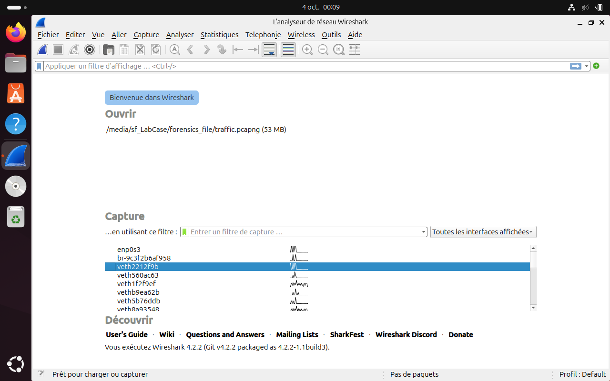
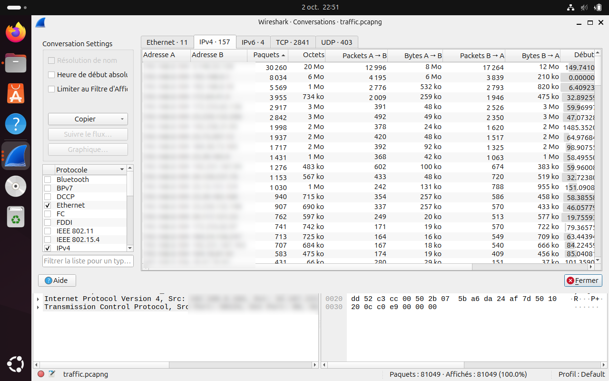
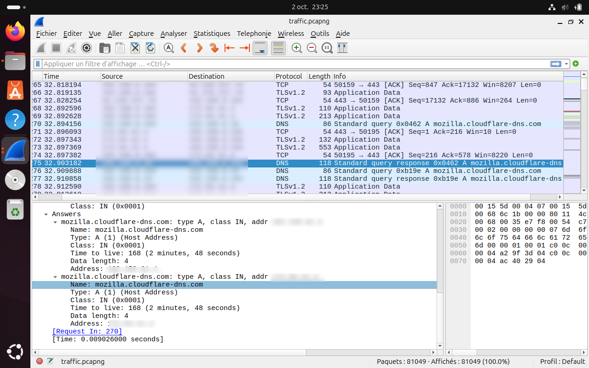
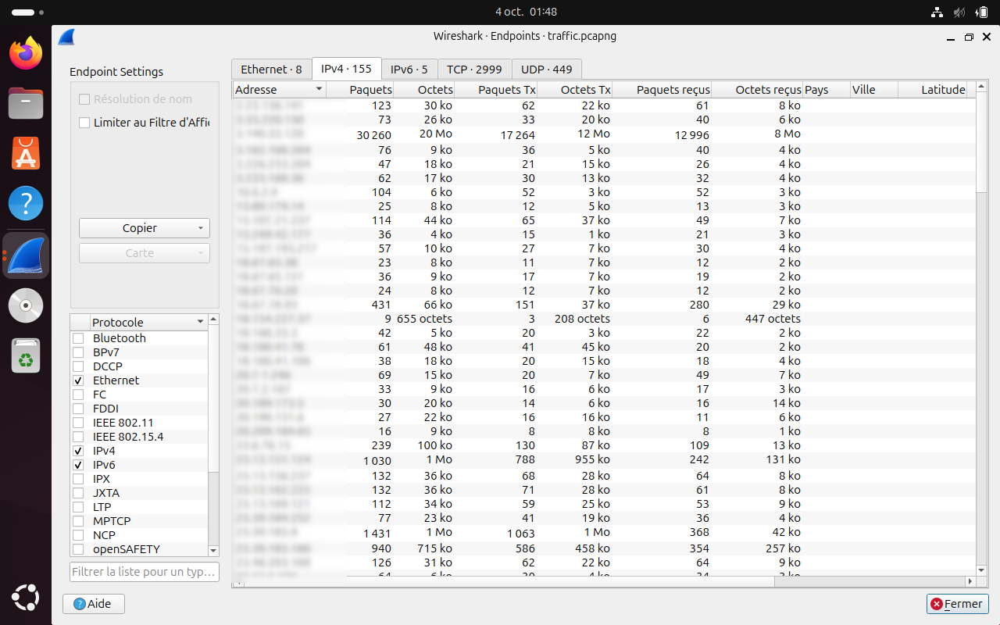
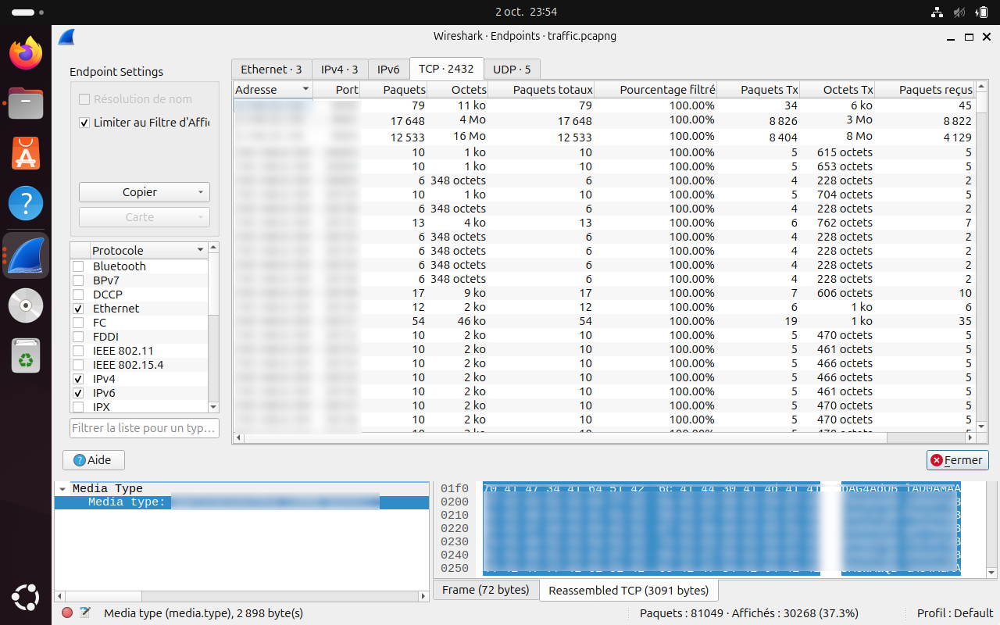
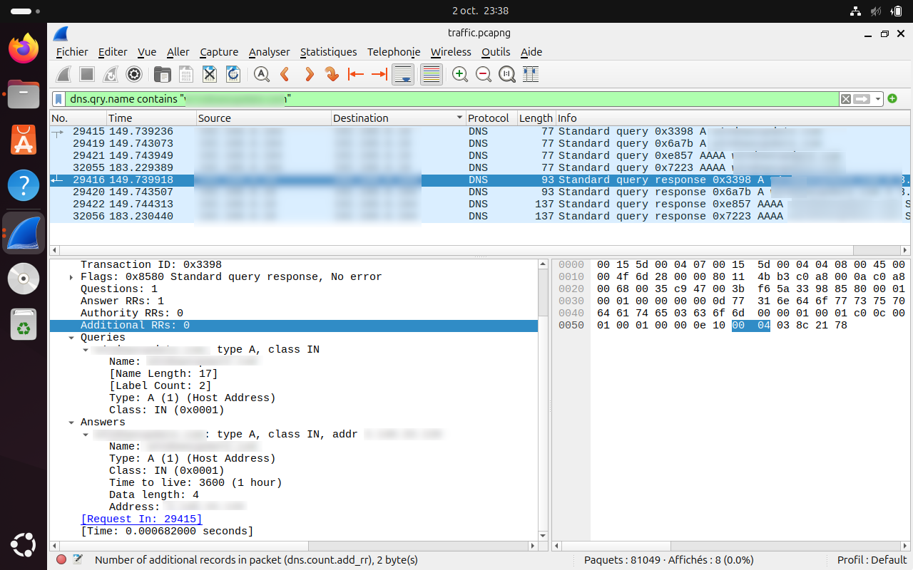
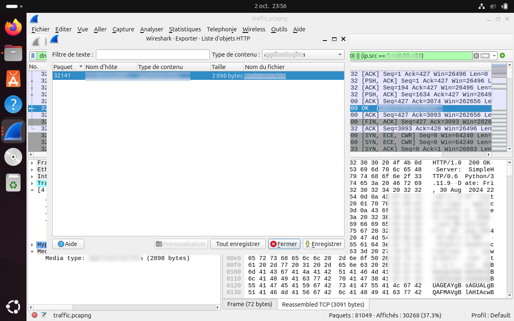
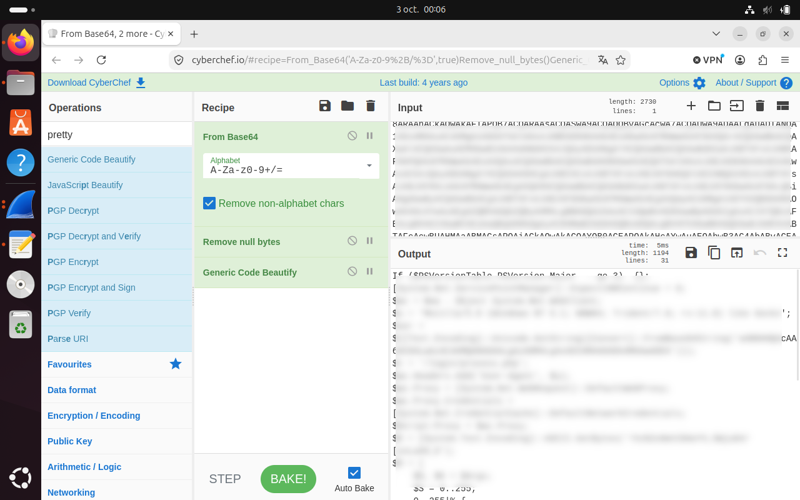
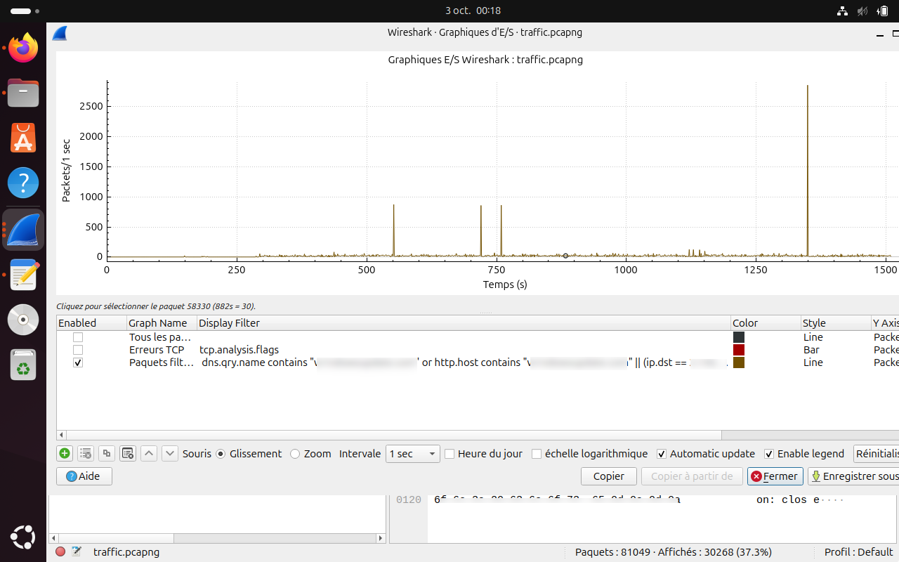
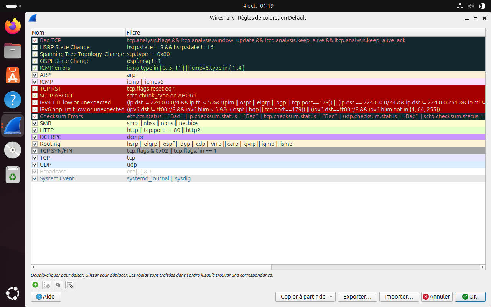

# Wireshark — DFIR Cheatsheet

Version: Wireshark 4.2.2 | Platform: Ubuntu 24.04 LTS | Scope: Network traffic analysis for incident response and digital forensics

> **How to use this cheatsheet**: Follow sections in order for a structured investigation. Each section builds on the previous one — from overview, to targeted filtering, to payload extraction and documentation.

---

## Table of Contents

1. [Interface Overview](#1-interface-overview)
2. [First Steps — Traffic Triage](#2-first-steps--traffic-triage)
3. [Display Filter Syntax](#3-display-filter-syntax)
4. [DNS Investigation](#4-dns-investigation)
5. [HTTP Investigation](#5-http-investigation)
6. [TCP/IP Investigation](#6-tcpip-investigation)
7. [TLS / Encrypted Traffic](#7-tls--encrypted-traffic)
8. [File and Object Extraction](#8-file-and-object-extraction)
9. [Stream Reconstruction](#9-stream-reconstruction)
10. [Traffic Pattern Visualization](#10-traffic-pattern-visualization)
11. [Profiles and Coloring Rules](#11-profiles-and-coloring-rules)
12. [tshark — CLI Reference](#12-tshark--cli-reference)
13. [Investigation Workflows](#13-investigation-workflows)
14. [Quick Reference Card](#14-quick-reference-card)

---

## 1. Interface Overview

### Wireshark main interface — annotated



The Wireshark interface is divided into three main panes:

| Pane | Content | DFIR Use |
|------|---------|----------|
| Packet List (top) | One row per packet — timestamp, src/dst, protocol, info | First-pass triage, filter results |
| Packet Details (middle) | Full protocol dissection of selected packet | Deep inspection of headers and payloads |
| Packet Bytes (bottom) | Raw hex + ASCII representation | Manual payload reading, IOC extraction |

**Key toolbar actions:**

| Shortcut | Action |
|----------|--------|
| `Ctrl+F` | Find packet by string or hex value |
| `Ctrl+G` | Go to packet by number |
| `Ctrl+Alt+F` | Apply display filter |
| `Ctrl+Shift+I` | Open I/O Graph |
| `Ctrl+Shift+E` | Export objects |

---

## 2. First Steps — Traffic Triage

Before applying any filter, build a mental model of the capture. This triage sequence should take under 5 minutes on any capture.

### Step 1 — Conversation ranking

```bash
Statistics → Conversations → IPv4 → Sort by Bytes ↓
```



**What to look for:**

- External IPs with disproportionate traffic volume
- Conversations starting shortly after the incident timestamp
- IPs outside the expected network range

### Step 2 — Protocol distribution

```bash
Statistics → Protocol Hierarchy
```



**What to look for:**

- HTTP on non-standard ports (`NON_STD_PORT`, e.g., 8000, 8080, 8443...)
- DNS with unusually high packet count (potential tunneling)
- Unexpected protocols for the environment (IRC, Tor, P2P)
- Cleartext protocols where encryption is expected

### Step 3 — Endpoint enumeration

```bash
Statistics → Endpoints → IPv4
```



**What to look for:**

- Unknown external IPs receiving significant outbound traffic
- Endpoints communicating outside business hours (correlate with timestamps)

### Step 4 — TCP endpoint detail

```bash
Statistics → Endpoints → TCP
```



Lists each IP:port pair individually — reveals which specific ports are active on a suspicious external IP. Critical for C2 identification.

---

## 3. Display Filter Syntax

### Basics

```bash
# Single condition
ip.src == VICTIM_IP

# Multiple conditions — AND
ip.src == VICTIM_IP && tcp.dstport == 443

# Multiple conditions — OR
http || dns

# Negation
!arp

# Contains (substring match)
http.host contains "suspicious"

# Matches (regex)
http.host matches "^[0-9]{1,3}\.[0-9]{1,3}"
```

### Filter bar behavior

| Background | Meaning |
|------------|---------|
| Green | Valid filter — ready to apply |
| Red | Syntax error — will not apply |
| Yellow | Valid but potentially unexpected results |

### Building filters incrementally

Right-click any value in the Packet Details pane:

- **Apply as Filter → Selected** — replace current filter with this value
- **Apply as Filter → And Selected** — add as AND condition
- **Apply as Filter → Or Selected** — add as OR condition
- **Prepare as Filter** — add to bar without applying (for building complex expressions)

### Quick-apply from packet list

Right-click any IP in the packet list:

- **Conversation Filter → IPv4** — all traffic between the two endpoints
- **Conversation Filter → TCP** — the specific TCP session only

---

## 4. DNS Investigation

DNS is typically the first artifact of a network-based compromise. A suspicious domain will appear in DNS before any other traffic.

### Filters

```bash
# All DNS traffic
dns

# Specific domain query
dns.qry.name == "suspicious-domain.tld"

# Partial domain match
dns.qry.name contains "suspicious"

# DNS responses only (contains answers)
dns.flags.response == 1 && dns.count.answers > 0

# Queries with no response (potential beaconing to non-existent domains)
dns.flags.response == 0

# Large DNS packets — potential DNS tunneling
dns && frame.len > 512

# NXDOMAIN responses (domain does not exist)
dns.flags.rcode == 3
```

### Statistics view

```bash
Statistics → DNS
```



### Pivoting from DNS to full traffic

Once a suspicious domain is identified, expand the filter to capture all associated traffic including the HTTP connection that follows:

```bash
dns.qry.name contains "suspicious-domain.tld"
or http.host contains "suspicious-domain.tld"
|| (ip.dst == C2_IP)
|| (ip.src == C2_IP)
```

> Replace `C2_IP` with the IP resolved by the DNS response.

---

## 5. HTTP Investigation

### Filters

```bash
# All HTTP traffic
http

# By method
http.request.method == "GET"
http.request.method == "POST"

# By host header
http.host == "target.com"
http.host contains "target"

# By URI (path)
http.request.uri contains ".exe"
http.request.uri contains ".hta"
http.request.uri contains ".ps1"
http.request.uri contains "/login"
http.request.uri contains "/upload"

# By response code
http.response.code == 200
http.response.code == 302      # Redirect
http.response.code == 404      # Not found
http.response.code == 500      # Server error

# By content type
http.content_type contains "application/hta"
http.content_type contains "application/octet-stream"
http.content_type contains "text/plain"
http.content_type contains "application/x-executable"

# Requests with a specific user-agent
http.user_agent contains "PowerShell"
http.user_agent contains "python"
http.user_agent contains "curl"
http.user_agent contains "wget"

# POST requests with body data
http.request.method == "POST" && http.request.uri contains "/login"
```

### HTTP Statistics

```bash
Statistics → HTTP → Requests
```


### Export objects

```bash
File → Export Objects → HTTP
```



Filter by content type in the dialog to isolate:

| Content-Type | File type | DFIR relevance |
|--------------|-----------|----------------|
| `application/hta` | HTA script | Stager, dropper |
| `application/octet-stream` | Generic binary | Payload, tool |
| `application/x-executable` | PE/ELF binary | Implant |
| `application/zip` | Archive | Exfiltration |
| `text/plain` | Script / data | Config, output |

---

## 6. TCP/IP Investigation

### IP Filters

```bash
# Bidirectional — all traffic involving a host
ip.addr == VICTIM_IP

# Source only
ip.src == VICTIM_IP

# Destination only
ip.dst == VICTIM_IP

# Exclude broadcast and multicast
ip.addr != 255.255.255.255 && !(ip.dst >= 224.0.0.0)

# Private IP ranges only
ip.addr >= 10.0.0.0 && ip.addr <= 10.255.255.255
```

### TCP Port Filters

```bash
# By destination port (replace with actual suspicious port)
tcp.dstport == NON_STD_PORT

# By port (either direction)
tcp.port == 443

# Non-standard HTTPS (TLS on unexpected ports)
tls && !(tcp.dstport == 443)

# High ephemeral ports (potential C2)
tcp.dstport >= 9000 && tcp.dstport <= 9999
```

### TCP Flag Filters

```bash
# New connections only (SYN, no ACK)
tcp.flags.syn == 1 && tcp.flags.ack == 0

# Connection resets (dropped/refused connections)
tcp.flags.reset == 1

# FIN — graceful connection close
tcp.flags.fin == 1

# Large data segments (potential exfiltration)
tcp.len > 1400

# Retransmissions (network issues or evasion attempts)
tcp.analysis.retransmission
```

---

## 7. TLS / Encrypted Traffic

TLS content cannot be decrypted without the server's private key or a pre-master secret log. However, the metadata is still actionable.

```bash
# All TLS traffic
tls

# TLS on non-standard port (potential C2 over HTTPS)
tls && !(tcp.dstport == 443)

# TLS handshake only (identifies new sessions)
tls.handshake

# Filter by SNI (Server Name Indication — hostname inside TLS hello)
tls.handshake.extensions_server_name contains "suspicious-domain.tld"

# Self-signed or unusual certificates
tls.handshake.certificate
```

> **Note**: SNI filtering is particularly useful — even in encrypted traffic, the destination hostname is visible in the TLS ClientHello (unless ECH/ESNI is enabled, rare in malware).

---

## 8. File and Object Extraction

### HTTP objects

```bash
File → Export Objects → HTTP
```

### SMB objects (file shares)

```bash
File → Export Objects → SMB
```

### Save raw bytes from a specific packet

```bash
Right-click packet → Export Packet Bytes → Save to file
```

### Reconstruct a file from a stream

1. Right-click any packet in the session → **Follow → TCP Stream**
2. In the stream window: select direction (C → S or S → C)
3. **Save as Raw bytes**

---

## 9. Stream Reconstruction

Following a stream reconstructs the full conversation between two endpoints, reassembling fragmented TCP segments automatically.

### How to follow a stream

Right-click any packet → **Follow →**

| Option | Content | Best for |
|--------|---------|----------|
| TCP Stream | Raw bytes, both directions | Any TCP session |
| HTTP Stream | HTTP headers + body | Web traffic |
| TLS Stream | TLS metadata only | Encrypted sessions |
| UDP Stream | Raw UDP payload | DNS, QUIC |



**Tips:**

- Switch direction using the dropdown at the bottom of the stream window
- Use Find (`Ctrl+F`) inside the stream to search for keywords
- Save as Raw to export the binary payload for further analysis

---

## 10. Traffic Pattern Visualization

### I/O Graph

```bash
Statistics → I/O Graphs
```



**How to use effectively:**

1. Keep the default "All packets" line as baseline
2. Add a second line with your targeted filter (e.g., C2 IP traffic)
3. Compare spikes against the baseline to identify anomalous bursts
4. Correlate spike timestamps with incident timeline events

**Patterns to recognize:**

| Pattern | Visual signature | Interpretation |
|---------|------------------|----------------|
| Regular periodic spikes | Evenly spaced pulses | Beaconing (C2 heartbeat) |
| Sustained high volume burst | Extended plateau | Data exfiltration / staging |
| Single sharp spike | Isolated peak | Payload delivery |
| Gradual increase | Rising slope | Progressive data transfer |

### Flow Graph

```bash
Statistics → Flow Graph
```

Sequential view of packet exchanges between endpoints. Useful for reconstructing the exact order of events in a specific session.

---

## 11. Profiles and Coloring Rules

### Creating a DFIR profile

```bash
Edit → Configuration Profiles → + (New)
Name: DFIR
```

A dedicated profile preserves custom coloring rules and column layouts without affecting the default profile.

### Recommended coloring rules for DFIR

```bash
View → Coloring Rules
```



| Rule name | Filter | Color suggestion |
|-----------|--------|------------------|
| HTTP on non-standard ports | `http && !(tcp.dstport == 80)` | Orange background |
| DNS large packets | `dns && frame.len > 512` | Yellow background |
| TCP resets | `tcp.flags.reset == 1` | Red text |
| TLS on non-443 | `tls && !(tcp.dstport == 443)` | Purple background |
| PowerShell user-agent | `http.user_agent contains "PowerShell"` | Red background |

### Recommended column layout

```bash
Edit → Preferences → Appearance → Columns
```

| Column | Field | Format |
|--------|-------|--------|
| Time | `frame.time_relative` | Time (seconds from capture start) |
| Source | `ip.src` | — |
| Src Port | `tcp.srcport` | — |
| Destination | `ip.dst` | — |
| Dst Port | `tcp.dstport` | — |
| Protocol | `frame.protocols` | — |
| Length | `frame.len` | — |
| Info | `_ws.col.info` | — |

> Adding source and destination port columns eliminates the need to open each packet to identify the port — critical for high-volume triage.

---

## 12. tshark — CLI Reference

`tshark` is the command-line equivalent of Wireshark. Same display filters, no GUI required — essential for scripting, remote analysis, and large captures.

### Basic usage

```bash
# Read a capture and display packets
tshark -r capture.pcapng

# Apply a display filter
tshark -r capture.pcapng -Y "http.request"

# Extract specific fields (tab-separated)
tshark -r capture.pcapng -Y "dns" \
  -T fields -e frame.time -e dns.qry.name -e dns.a

# Output as CSV
tshark -r capture.pcapng -Y "dns" \
  -T fields -e frame.time -e dns.qry.name -e dns.a \
  -E separator=, -E header=y > dns_queries.csv
```

### Useful one-liners (field-tested)

```bash
# Top 20 destination IPs by frequency
tshark -r capture.pcapng -T fields -e ip.dst \
  | sort | uniq -c | sort -rn | head -20

# All unique domains queried
tshark -r capture.pcapng -Y "dns.flags.response == 0" \
  -T fields -e dns.qry.name \
  | sort -u

# All HTTP requests with host and URI
tshark -r capture.pcapng -Y "http.request" \
  -T fields -e frame.time -e ip.src -e ip.dst \
  -e http.host -e http.request.method -e http.request.uri \
  -E separator="," -E header=y > http_requests.csv

# Identify HTTP user agents
tshark -r capture.pcapng -Y "http.request" \
  -T fields -e http.user_agent | sort -u

# DNS responses — domain to IP mapping
tshark -r capture.pcapng \
  -Y "dns.flags.response == 1 && dns.count.answers > 0" \
  -T fields -e dns.qry.name -e dns.a \
  | sort -u

# List all TCP connections established (SYN-ACK)
tshark -r capture.pcapng -Y "tcp.flags.syn==1 && tcp.flags.ack==1" \
  -T fields -e ip.src -e tcp.srcport -e ip.dst -e tcp.dstport \
  | sort -u

# Export all HTTP objects to a directory
tshark -r capture.pcapng --export-objects http,/tmp/http_exports/

# Total bytes per destination IP (outbound volume)
tshark -r capture.pcapng -q -z conv,ip \
  | awk 'NR>5 {print $3, $8}' | sort -k2 -rn | head -20
```

---

## 13. Investigation Workflows

### Workflow A — Malware delivery via HTTP

1. **Statistics → Conversations → IPv4 → Sort by Bytes** → Identify suspicious external IP
2. `dns.qry.name contains "suspicious-domain.tld"` → Confirm domain resolution and note resolved IP
3. `dns.qry.name contains "domain" or http.host contains "domain" || (ip.dst == C2_IP) || (ip.src == C2_IP)` → Isolate all related traffic
4. **Statistics → Endpoints → TCP** (with filter active) → Note all ports used and their volumes
4. `http.request` → Follow HTTP Stream → Inspect GET/POST requests and server responses
5. **File → Export Objects → HTTP** → Extract delivered files for static analysis
6. **Document**: IP, domain, port, filename, content-type, timestamp

### Workflow B — C2 Identification

1. Identify suspicious IP from conversation triage (§2)
2. `(ip.src == C2_IP) || (ip.dst == C2_IP)` → Isolate all traffic with the IP
3. **Statistics → Endpoints → TCP** (filter active) → Note all active ports and volumes
4. For each suspicious port: `tcp.dstport == PORT → Follow TCP Stream` → Look for: periodic beaconing, encoded data, HTTP-like patterns, command/response structure
5. **Statistics → I/O Graph** (with filter active) → Identify beaconing pattern (regular spikes = heartbeat)
6. If HTTP-based C2: `http.host matches IP` → inspect User-Agent, URI, Cookie headers → C2 frameworks leave characteristic fingerprints
7. **Document**: IP, port, protocol, session timestamps, volume, pattern

### Workflow C — Data Exfiltration Assessment

1. Identify outbound high-volume conversations: **Statistics → Conversations → IPv4 → Sort by Bytes A→B** (A→B = client to server, i.e. outbound)
2. Filter to suspicious destination: `ip.dst == C2_IP` → check frame sizes and timing
3. **Statistics → I/O Graph** → Sustained high volume = bulk transfer; Single spike = compressed archive upload
4. If HTTP: `http.request.method == "POST"` → Inspect POST body size and destination URI
5. **Estimate volume**: Conversations view → Bytes A→B column for the specific conversation
6. **Document**: destination IP, port, protocol, estimated volume, timestamps, URI if HTTP

---

## 14. Quick Reference Card

### Most-used filters

```bash
# Baseline isolation
ip.addr == VICTIM_IP

# Full C2 traffic isolation
(ip.dst == C2_IP) || (ip.src == C2_IP)

# Suspicious domain — all traffic
dns.qry.name contains "domain" or http.host contains "domain"
|| (ip.dst == C2_IP) || (ip.src == C2_IP)

# Executable/script delivery
http.content_type contains "application/octet-stream"
  or http.content_type contains "application/hta"
  or http.content_type contains "application/x-executable"

# Suspicious user agents
http.user_agent contains "PowerShell"
  or http.user_agent contains "python"
  or http.user_agent contains "curl"

# Non-standard TLS
tls && !(tcp.dstport == 443)

# Large DNS (tunneling indicator)
dns && frame.len > 512

# New TCP connections
tcp.flags.syn == 1 && tcp.flags.ack == 0
```

### Key statistics locations

| What you need | Where to find it |
|---------------|------------------|
| Top talkers | Statistics → Conversations → IPv4 |
| Active ports on an IP | Statistics → Endpoints → TCP |
| Protocol breakdown | Statistics → Protocol Hierarchy |
| Domain queries | Statistics → DNS |
| HTTP URIs | Statistics → HTTP → Requests |
| Traffic timeline | Statistics → I/O Graphs |
| Session sequence | Statistics → Flow Graph |

### File extraction

| File type | Method |
|-----------|--------|
| HTTP files | File → Export Objects → HTTP |
| SMB files | File → Export Objects → SMB |
| Raw stream | Follow TCP Stream → Save as Raw |
| Specific packet bytes | Right-click → Export Packet Bytes |

---

## Screenshots Reference

All screenshots stored in `../screenshots/wireshark-cheatsheet/`:

| File | Section | Description |
|------|---------|-------------|
| `01-interface-overview.png` | §1 | Three-pane interface annotated |
| `02-conversations-ipv4.png` | §2.1 | Conversations sorted by bytes |
| `03-protocol-hierarchy.png` | §2.2 | Protocol Hierarchy view |
| `04-endpoints-ipv4.png` | §2.3 | Endpoints IPv4 |
| `05-tcp-endpoints.png` | §2.4 | TCP Endpoints with suspicious ports |
| `06-dns-statistics.png` | §4 | DNS Statistics summary |
| `07-http-statistics.png` | §5 | HTTP Requests Statistics |
| `08-export-http-objects.png` | §5/8 | Export HTTP Objects dialog |
| `09-follow-tcp-stream.png` | §9 | Follow TCP Stream window (red/blue) |
| `10-io-graph.png` | §10 | I/O Graph with baseline + C2 filter |
| `11-coloring-rules.png` | §11 | Coloring Rules configuration |